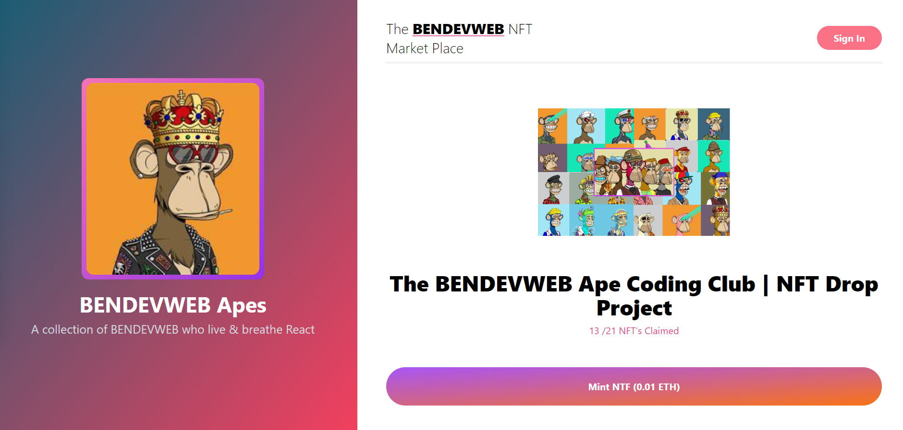

# **Web3.0 NFT Market Place App**

## Application built with

<div style="margin-bottom: 10px;"></div>

 <span style="margin-left: 6px;"></span> 

<div style="margin: 10px 0px">

<span style="margin-left: 5px;"></span>

</div>

#

## **Home page render**

<div>

</div>

#

## **Metamask wallet** 🦊

Options to be activated

In your `Metamask wallet` go to :

> settings

> advanced settings

and activate the two options below

```
Show conversion on Testnets
Select this option to display the conversion of fiat currencies on Testnets.
```

> <span style="color: #bde0fe; font-weight: bold;">ON</span>

```
Show test networks
Select this to display the test networks in the list of networks
```

> <span style="color: #bde0fe; font-weight: bold;">ON</span>

#

### **How to use Next.js + Tailwind CSS**

This example shows how to use [Tailwind CSS](https://tailwindcss.com/) [(v3.0)](https://tailwindcss.com/blog/tailwindcss-v3) with Next.js. It follows the steps outlined in the official [Tailwind docs](https://tailwindcss.com/docs/guides/nextjs).

Execute [`create-next-app`](https://github.com/vercel/next.js/tree/canary/packages/create-next-app) with [npm](https://docs.npmjs.com/cli/init), [Yarn](https://yarnpkg.com/lang/en/docs/cli/create/), or [pnpm](https://pnpm.io) to bootstrap the example:

```bash
npx create-next-app --example with-tailwindcss with-tailwindcss-app
```

```bash
yarn create next-app --example with-tailwindcss with-tailwindcss-app
```

```bash
pnpm create next-app --example with-tailwindcss with-tailwindcss-app
```

#

### **Deploy Ressources**

Deploy the example using [Vercel](https://vercel.com?utm_source=github&utm_medium=readme&utm_campaign=next-example) or preview live with [StackBlitz](https://stackblitz.com/github/vercel/next.js/tree/canary/examples/with-tailwindcss)

[](https://vercel.com/new/git/external?repository-url=https://github.com/vercel/next.js/tree/canary/examples/with-tailwindcss&project-name=with-tailwindcss&repository-name=with-tailwindcss)

Deploy it to the cloud with [Vercel](https://vercel.com/new?utm_source=github&utm_medium=readme&utm_campaign=next-example) ([Documentation](https://nextjs.org/docs/deployment)).

#
